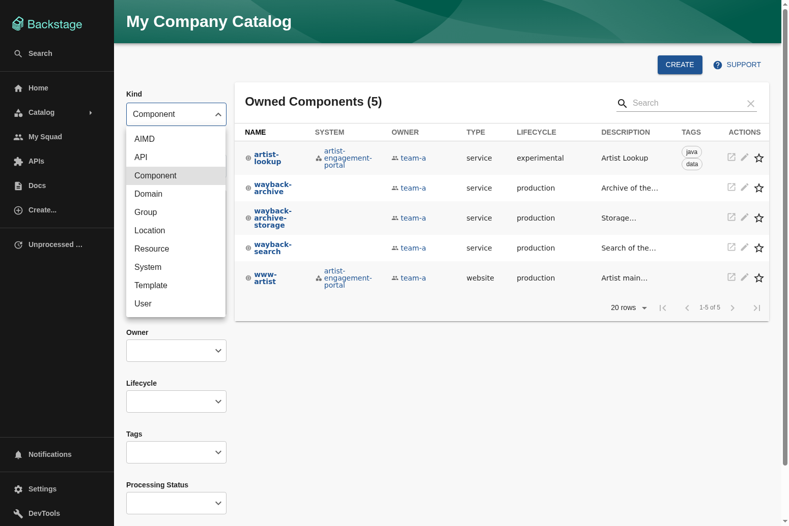
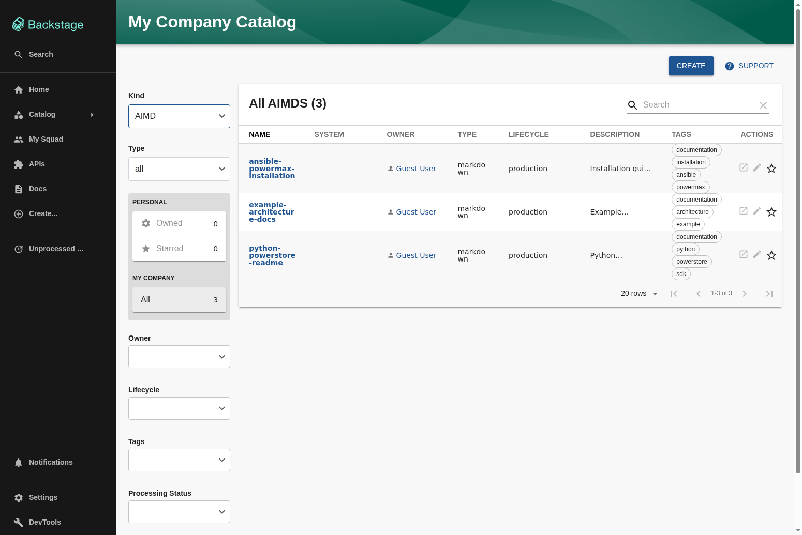
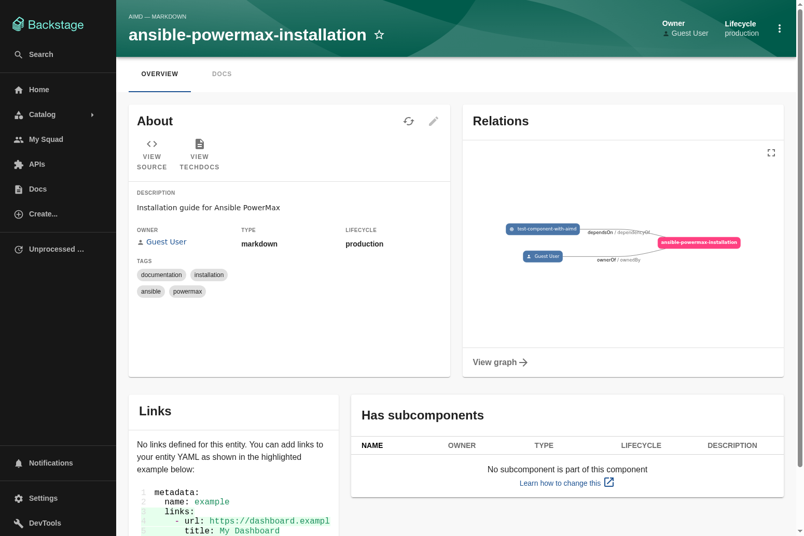
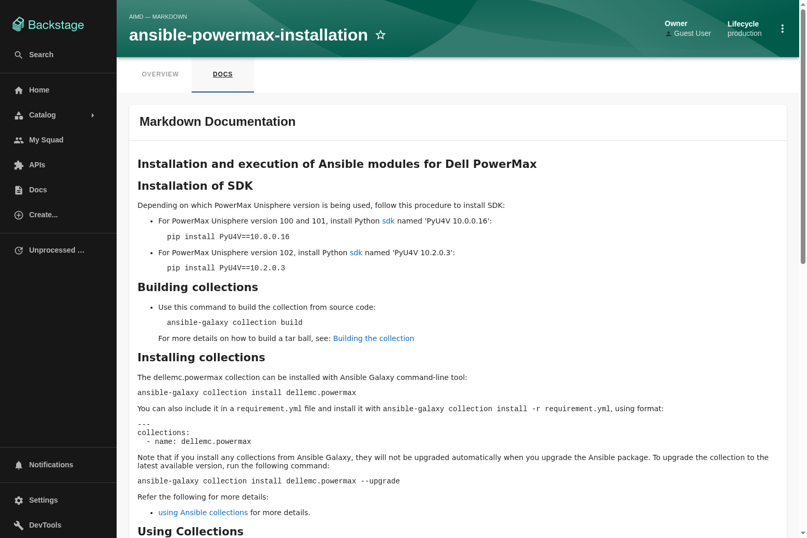

# AIMD - AI Markdown Documentation Plugin for Backstage

The AIMD plugin adds a new catalog entity kind to Backstage for managing and displaying markdown documentation. Similar to how the API plugin works with OpenAPI specifications, AIMD allows you to register markdown files as first-class entities in your Backstage catalog, making documentation discoverable, searchable, and integrated with your software components.

## Overview

AIMD (AI Markdown Documentation) provides:

- **New Catalog Kind**: Register markdown documentation as AIMD entities in your Backstage catalog
- **Rich Markdown Rendering**: Display documentation with proper formatting, syntax highlighting, code blocks, tables, and GitHub Flavored Markdown support
- **Relations System**: Link components to their documentation using `consumesAimd` relations (similar to `consumesApi`)
- **Catalog Integration**: Browse, search, and filter AIMD entities just like any other catalog entity
- **Flexible Sources**: Fetch markdown from HTTP/HTTPS URLs or include inline content

## Architecture

This workspace contains two packages that work together:

### Backend Module

**[@backstage-community/plugin-catalog-backend-module-aimd](./plugins/catalog-backend-module-aimd/README.md)**

The backend module provides:

- AIMD entity kind definition with JSON schema validation
- Entity processors for validation and relation handling
- Support for `consumesAimd`/`aimdConsumedBy` relations
- Integration with Backstage's catalog processing pipeline

### Frontend Plugin

**[@backstage-community/plugin-aimd](./plugins/aimd/README.md)**

The frontend plugin provides:

- `EntityAimdContent` component for displaying markdown documentation
- Entity page integration for AIMD entities
- Markdown rendering with syntax highlighting
- Support for fetching content from URLs

## Quick Start

### 1. Install Backend Module

Add the backend module to your Backstage backend:

```bash
yarn workspace backend add @backstage-community/plugin-catalog-backend-module-aimd
```

Then register it in your backend:

```typescript
// packages/backend/src/index.ts
import { createBackend } from '@backstage/backend-defaults';

const backend = createBackend();

// ... other plugins

backend.add(import('@backstage-community/plugin-catalog-backend-module-aimd'));

backend.start();
```

### 2. Install Frontend Plugin

Add the frontend plugin to your Backstage app:

```bash
yarn workspace app add @backstage-community/plugin-aimd
```

Then add AIMD content to your entity pages:

```tsx
// packages/app/src/components/catalog/EntityPage.tsx
import {
  EntityAimdContent,
  isAimdAvailable,
} from '@backstage-community/plugin-aimd';

const aimdPage = (
  <EntityLayout>
    <EntityLayout.Route path="/" title="Overview">
      <Grid container spacing={3}>
        <Grid item xs={12}>
          <EntityAboutCard variant="gridItem" />
        </Grid>
      </Grid>
    </EntityLayout.Route>
    <EntityLayout.Route path="/docs" title="Docs">
      <EntityAimdContent />
    </EntityLayout.Route>
  </EntityLayout>
);

export const entityPage = (
  <EntitySwitch>
    {/* ... other cases ... */}
    <EntitySwitch.Case if={isAimdAvailable} children={aimdPage} />
  </EntitySwitch>
);
```

### 3. Create AIMD Entities

Create AIMD entities in your catalog:

```yaml
apiVersion: backstage.io/v1alpha1
kind: AIMD
metadata:
  name: architecture-docs
  description: System architecture documentation
  tags:
    - documentation
    - architecture
spec:
  type: markdown
  lifecycle: production
  owner: platform-team
  system: core-platform
  definition: https://raw.githubusercontent.com/example/repo/main/docs/ARCHITECTURE.md
```

## Features

### Markdown Rendering

AIMD supports rich markdown rendering with:

- Headers (H1-H6)
- Code blocks with syntax highlighting
- Tables
- Lists (ordered and unordered)
- Links
- Images
- Blockquotes
- Inline code

### Relations

#### consumesAimd / aimdConsumedBy

Components can declare that they consume AIMD documentation using the `aimd.io/consumes` annotation:

```yaml
apiVersion: backstage.io/v1alpha1
kind: Component
metadata:
  name: my-service
  annotations:
    aimd.io/consumes: 'aimd:default/architecture-docs, aimd:default/api-guide'
spec:
  type: service
  lifecycle: production
  owner: platform-team
```

This creates bidirectional relations:

- `consumesAimd` relations from the component to the AIMD entities
- `aimdConsumedBy` relations from the AIMD entities back to the component

#### Standard Relations

AIMD entities support all standard Backstage relations:

- `ownedBy` / `ownerOf` - Link to the team or user that owns the documentation
- `partOf` / `hasPart` - Link to the system the documentation belongs to
- `dependsOn` / `dependencyOf` - Link to other entities the documentation depends on

### Entity Schema

AIMD entities follow this schema:

```yaml
apiVersion: backstage.io/v1alpha1
kind: AIMD
metadata:
  name: <entity-name> # Required: Unique identifier
  description: <description> # Optional: Human-readable description
  tags: # Optional: Tags for categorization
    - documentation
    - <custom-tags>
  annotations: # Optional: Additional metadata
    <key>: <value>
spec:
  type: <type> # Required: Type of documentation (e.g., "markdown", "mdx")
  lifecycle: <lifecycle> # Required: Lifecycle state (e.g., "production", "experimental", "deprecated")
  owner: <entity-ref> # Required: Owner entity reference (e.g., "user:default/guest")
  system: <entity-ref> # Optional: System entity reference
  definition: <url-or-content> # Required: URL to markdown file or inline content
```

## Examples

### Architecture Documentation

```yaml
apiVersion: backstage.io/v1alpha1
kind: AIMD
metadata:
  name: system-architecture
  description: High-level system architecture documentation
  tags:
    - architecture
    - design
spec:
  type: markdown
  lifecycle: production
  owner: platform-team
  system: core-platform
  definition: https://github.com/example/repo/blob/main/docs/ARCHITECTURE.md
```

### API Documentation

```yaml
apiVersion: backstage.io/v1alpha1
kind: AIMD
metadata:
  name: rest-api-guide
  description: REST API usage guide and examples
  tags:
    - api
    - guide
spec:
  type: markdown
  lifecycle: production
  owner: api-team
  definition: https://raw.githubusercontent.com/example/repo/main/docs/API.md
```

### Component with AIMD References

```yaml
apiVersion: backstage.io/v1alpha1
kind: Component
metadata:
  name: payment-service
  annotations:
    aimd.io/consumes: 'aimd:default/system-architecture, aimd:default/rest-api-guide'
spec:
  type: service
  lifecycle: production
  owner: payments-team
  system: core-platform
```

## Screenshots

### AIMD Kind in Catalog Filter



### AIMD Entities in Catalog



### AIMD Entity Overview Page



### Markdown Rendering



## Development

### Running Tests

```bash
# Run all tests
yarn test

# Run tests for backend module
yarn workspace @backstage-community/plugin-catalog-backend-module-aimd test

# Run tests for frontend plugin
yarn workspace @backstage-community/plugin-aimd test
```

### Building

```bash
# Build all packages
yarn build

# Build backend module
yarn workspace @backstage-community/plugin-catalog-backend-module-aimd build

# Build frontend plugin
yarn workspace @backstage-community/plugin-aimd build
```

### Linting

```bash
# Lint all packages
yarn lint

# Fix linting issues
yarn lint --fix
```

## Documentation

- [Backend Module README](./plugins/catalog-backend-module-aimd/README.md) - Detailed backend module documentation
- [Frontend Plugin README](./plugins/aimd/README.md) - Detailed frontend plugin documentation

## Contributing

Contributions are welcome! Please read the [Backstage Community Plugins Contributing Guide](../../CONTRIBUTING.md) for details on our code of conduct and the process for submitting pull requests.

## License

Copyright 2025 The Backstage Authors. Licensed under the Apache License, Version 2.0.
